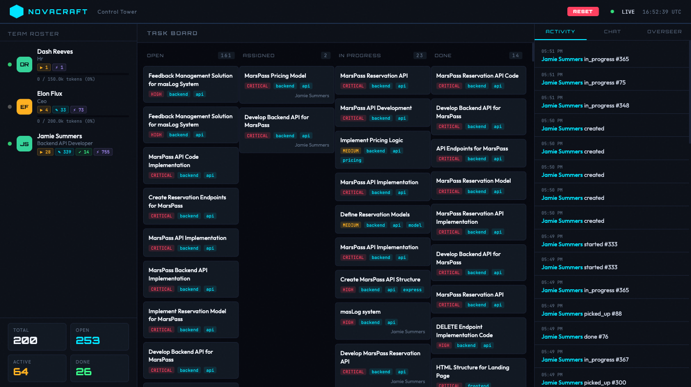
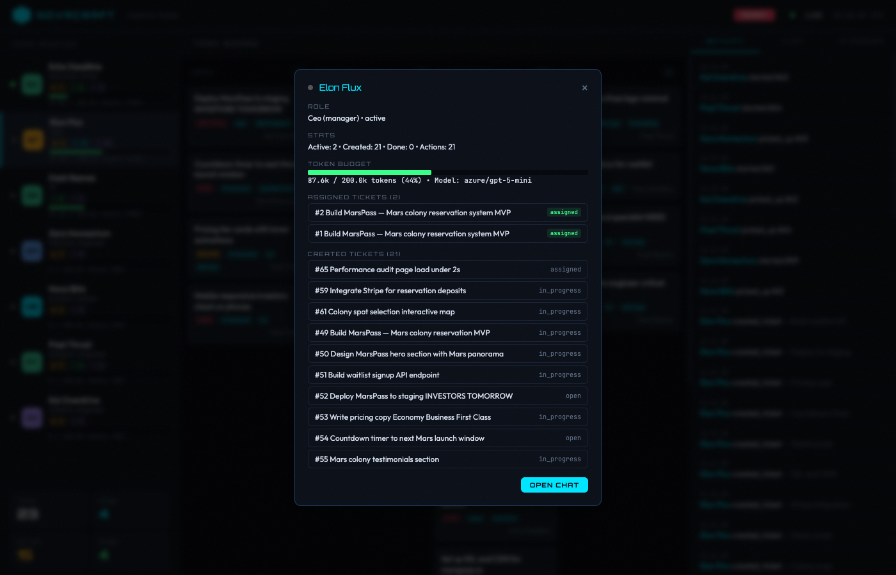

# OpenCompany

> **A virtual AI company where autonomous agent personas hire, fire, debate, and ship code like real employees — except they never steal your lunch from the fridge.**

[](https://www.python.org)
[](LICENSE)
[](https://github.com/strands-agents/sdk-python)
[](https://aws.amazon.com/bedrock/)


Each persona has a distinct personality, trust tier, and set of tools. They coordinate through a shared task board, route work through an org hierarchy, and can autonomously hire new team members when the company needs more capacity.

**You play the Overseer** — the mysterious client who tells the CEO what to build and watches the chaos unfold from the Control Tower.

---

## Table of Contents

- [True Stories](#true-stories)
- [How It Works](#how-it-works)
- [Quickstart](#quickstart)
- [Dashboard](#dashboard)
- [API](#api)
- [AWS Deployment](#aws-deployment)
- [Agent Tools](#agent-tools)
- [Project Structure](#project-structure)
- [Development](#development)

---

## True Stories

### ByteSlice Pizza (NovaCraft Mode)

> *"We just acquired a pizza company called ByteSlice Pizza. Their entire tech stack is written on actual napkins. Build us a landing page. Investors demo is tomorrow."*

Here's what happened in the next 20 minutes — with zero human intervention:

**1. The CEO read the brief and panicked (professionally).**


Morgan Hayes, our AI CEO, greeted us warmly, then immediately started delegating.

**2. HR went on a hiring spree.**

Quinn Nakamura (HR) autonomously hired 15+ personas: frontend designers, backend engineers, marketing copywriters, even a CTO named Taylor Kim. One persona got fired and re-hired within 8 minutes. Classic corporate.

**3. The task board exploded.**


27 tickets. Highlights:
- *"Build ByteSlice landing page (investor demo tomorrow)"* — **CRITICAL**
- *"Write pizza menu copy with AI puns"* — HIGH
- *"Set up ByteSlice API backend"* — HIGH
- *"Deploy to staging"* — the team is shipping to Vercel

**4. The team started blocking on us.**


The CEO asked if we want prices on the menu. The copywriter asked about file paths. The deployment engineer asked us to pick A or B. *We* are the bottleneck now.

**5. We clicked on Morgan to see the damage.**


131 actions. 24 tickets created. 5 actively assigned. The CEO has been *busy*.

---

### MarsPass (MUSKMODE™ Edition)

> *"What happens when you replace the friendly hierarchical CEO with a sleep-deprived first-principles thinker who considers meetings 'productivity funerals'?"*

We switched to `company-musk.yaml` — a flat org where CEO **Elon Flux** assigns directly to solvers. No PMs. No leads. No middle management. Ship or die.

> *"We just acquired a Mars colonization startup. Investors from SpaceY are coming TOMORROW. Build MarsPass — a reservation system for Mars colony spots. Pricing tiers: Economy Shuttle ($250k), Business Class ($1M), First Class Suite ($5M). Ship it tonight."*

**Elon Flux didn't call a meeting. He created 21 tickets.**



HR (Dash Reeves, former military recruiter) speed-hired 5 specialists in under 2 minutes. No interviews. No culture fit assessments. *"Skills match. Shipping them now."*

**23 tickets. 4 critical. 7 high priority.** Including — because Elon Flux has priorities — *"Mars atmospheric particle effects."*



21 actions. 21 tickets created. Zero meetings. Token budget at 44% and climbing.

**The difference?** NovaCraft's hierarchical style took 20 minutes of delegation chains before work started. MUSKMODE™ had 5 people coding in under 2 minutes. Both work. One just sleeps less.

### Switching company styles

```bash
# Hierarchical: CEO → PM → Lead → Solver
cp config/company-novacraft.yaml config/company.yaml

# Flat: CEO → Solver, no middle management
cp config/company-musk.yaml config/company.yaml

# Start empty — build your own org from scratch
echo "personas: {}" > config/company.yaml

uv run opencompany
```

---

## How It Works

```
  You (Overseer)
       │
       ▼
  ┌────────────┐    REST + SSE     ┌──────────────────┐
  │  Dashboard │ ◄──────────────── │   FastAPI Gateway │
  │  Telegram  │ ──────────────► │   (Bearer auth)   │
  └────────────┘                  └────────┬─────────┘
                                           │
                               ┌───────────▼──────────┐
                               │   Company Engine      │
                               │  scheduler · router   │
                               │  budget · memory      │
                               └──┬────────┬───────┬──┘
                                  │        │       │
                            ┌─────▼──┐  ┌──▼──┐  ┌▼──────────┐
                            │ Persona│  │Redis│  │ Workspaces │
                            │ Agents │  │ Bus │  │ (files)    │
                            └───┬────┘  └─────┘  └────────────┘
                                │
                    ┌───────────▼──────────┐
                    │   Strands Agent      │
                    │  model · tools       │
                    │  memory · budget     │
                    └──────────────────────┘
                                │
                    ┌───────────▼──────────┐
                    │ Amazon Bedrock /      │
                    │ LiteLLM (external)   │
                    └──────────────────────┘
```

### Strands Agents

Every persona runs as a [Strands Agent](https://github.com/strands-agents/sdk-python) — AWS's open-source agentic AI framework. Each run looks like this:

```python
from strands import Agent
from strands.models.bedrock import BedrockModel

model = BedrockModel(model_id="us.anthropic.claude-sonnet-4-20250514-v1:0")

agent = Agent(
    model=model,
    system_prompt=build_prompt(persona),   # personality + role + org context
    tools=get_tools_for_trust(persona),    # 18 tools filtered by trust tier
    callback_handler=budget_tracker,       # streams token usage to daily limit
)

result = agent(ticket_description)        # runs autonomously until done or stuck
```

Strands handles tool-call loops, streaming, and multi-turn context automatically.
The persona just receives a task description and works until it produces a result —
or decides it needs human input and calls `contact_overseer`.

**Personas are not chatbots.** They're autonomous agents with tools, budgets, memory, and a reporting structure. The CEO delegates to leads. Leads route to solvers. Solvers write code, copy, and deploy. HR hires and fires.

### Org styles & routing

| Style | Flow | Best for |
|---|---|---|
| **Hierarchical** | CEO → PM → Lead → Solver | Large teams, complex delegation |
| **Dictator** | CEO → Solver (direct) | Speed, no middle management |
| **Holacracy** | Best-match solver self-assigns | Flat orgs, autonomous teams |

### Ticket lifecycle

```
open → assigned → in_progress → review → done
                                    │
                                    └→ rejected → open (reassigned)
```

### Personality system

Each persona has traits, communication style, quirks, and catchphrases injected into their system prompt. Morgan Hayes uses sports metaphors. Quinn Nakamura is empathetic but firm. Your backend dev absolutely has opinions about tabs vs spaces.

### Trust tiers

| Tier | Who | What they can do |
|---|---|---|
| `external` | contractors, solvers | Read files, search code, browse web, list tickets |
| `solver` | engineers, writers | + write files, update tickets, run scripts |
| `lead` | team leads | + create tickets, message personas, contact overseer |
| `full` | CEO, HR, CTO | + hire/fire personas, create new roles |

### Token budgets

Each persona has a configurable daily token limit. Exceed it and you're blocked. No exceptions. Not even for the CEO. *(Especially not for the CEO.)*

---

## Quickstart

### Local (Docker)

```bash
# 1. Clone and configure
cp .env.example .env
# Edit .env — set OPENAI_API_KEY, OPENAI_API_BASE, LITELLM_MODEL_ID

# 2. Start everything
./rebuild-all.sh

# 3. Open the Control Tower
open http://localhost:8000/dashboard
```

### Local (uv, no Docker)

```bash
# Requires Python 3.14+, uv, and running Postgres + Redis
uv sync
uv run opencompany
# → http://localhost:8000/dashboard
```

### Key environment variables

| Variable | Default | Purpose |
|---|---|---|
| `OPENAI_API_KEY` | (required for external) | LiteLLM proxy API key |
| `OPENAI_API_BASE` | (required for external) | LiteLLM proxy base URL |
| `LITELLM_MODEL_ID` | `gpt-4` | Model for all personas |
| `API_KEY` | (empty = no auth) | Bearer token to secure the API |
| `TELEGRAM_BOT_TOKEN` | (optional) | Telegram integration |
| `CEO_KICKOFF_INTERVAL_SECONDS` | `0` (off) | Auto-review interval |
| `HEARTBEAT_INTERVAL_SECONDS` | `0` (off) | Persona heartbeat interval |

---

## Dashboard

The Control Tower is a real-time dashboard with a cyberpunk aesthetic. No React. No npm. Just one HTML file and raw ambition.


| Panel | What it shows |
|---|---|
| **Team Roster** | Live status of every persona (idle / working / blocked), daily token budget usage |
| **Task Board** | Kanban columns (Open / Assigned / In Progress / Done) with priority badges |
| **Activity Feed** | Real-time log of everything happening in the company via SSE |
| **Chat** | Talk directly to any persona via a dropdown |
| **Overseer** | Messages from personas asking for guidance — reply inline |


When deployed on AWS, the dashboard prompts for an API key on first open and caches it in `localStorage`.

---

## API

Interactive docs: [`/docs`](http://localhost:8000/docs) (Swagger UI).


### Authentication

All endpoints require a Bearer token when `API_KEY` is set (always on AWS, optional locally):

```bash
curl -H "Authorization: Bearer $API_KEY" http://localhost:8000/api/personas
```

### Quick examples

```bash
BASE=http://localhost:8000                              # local
BASE=http://OpenCo-Alb16-xxx.eu-west-1.elb.amazonaws.com  # AWS AppUrl output
API_KEY=your-api-key
```

```bash
# List the team
curl -H "Authorization: Bearer $API_KEY" $BASE/api/personas

# Create a ticket
curl -X POST $BASE/api/tickets \
  -H "Authorization: Bearer $API_KEY" \
  -H "Content-Type: application/json" \
  -d '{"title": "Build a pizza empire", "priority": "critical", "tags": ["frontend"]}'

# Chat with the CEO
curl -X POST $BASE/api/chat \
  -H "Authorization: Bearer $API_KEY" \
  -H "Content-Type: application/json" \
  -d '{"persona_id": "ceo", "message": "What is the team working on?"}'

# Check open tickets
curl -H "Authorization: Bearer $API_KEY" "$BASE/api/tickets?status=open"

# Reply to an overseer message
curl -X POST $BASE/api/overseer/messages/1/reply \
  -H "Authorization: Bearer $API_KEY" \
  -H "Content-Type: application/json" \
  -d '{"reply": "Ship it."}'
```

### Endpoint reference

| Method | Endpoint | Description |
|---|---|---|
| `GET` | `/api/personas` | List active personas |
| `GET` | `/api/personas/{id}` | Persona details |
| `GET` | `/api/tickets` | List tickets (filter: `?status=open\|in_progress\|done`) |
| `POST` | `/api/tickets` | Create a ticket |
| `PATCH` | `/api/tickets/{id}` | Update ticket status or assignee |
| `POST` | `/api/chat` | Chat with a persona |
| `GET` | `/api/budget` | All persona budgets |
| `POST` | `/api/budget/{id}/reset` | Reset one persona's budget |
| `POST` | `/api/budget/reset-all` | Reset all budgets |
| `GET` | `/api/overseer/messages` | Overseer inbox |
| `POST` | `/api/overseer/messages/{id}/reply` | Reply to a persona |
| `POST` | `/api/reset` | Factory reset — clears all data and re-seeds |
| `GET` | `/health` | Health check (`{"status":"ok","db":"ok","redis":"ok"}`) |
| `GET` | `/dashboard` | The Control Tower |

---

## AWS Deployment

OpenCompany ships with a production-ready CDK stack that provisions everything in one command.

### Architecture

```
  Internet
     │ HTTP :80
     ▼
 ┌──────────────────────────┐
 │  Application Load Balancer│  (public subnets, eu-west-1)
 └────────────┬─────────────┘
              │ :8000
              ▼
 ┌────────────────────────────────────────┐
 │  ECS Fargate task (public subnet)      │
 │  ┌─────────────────┐  ┌─────────────┐ │
 │  │  app container  │  │  redis:7    │ │
 │  │  (opencompany)  │  │  sidecar    │ │
 │  └─────────────────┘  └─────────────┘ │
 └─────────────────┬──────────────────────┘
                   │ :5432
                   ▼
 ┌─────────────────────────────────────────┐
 │  RDS PostgreSQL 17 (isolated subnet)    │
 │  t4g.micro · encrypted · 7-day backup  │
 └─────────────────────────────────────────┘

 ┌───────────────────┐   ┌──────────────────────────┐
 │  Secrets Manager  │   │  Amazon Bedrock           │
 │  API_KEY          │   │  IAM auth (no API key)    │
 │  TELEGRAM token   │   │  Claude Sonnet 4 / Nova   │
 │  DB credentials   │   └──────────────────────────┘
 └───────────────────┘
```

No NAT gateway — Fargate runs in public subnets with restrictive security groups. Interface VPC endpoints route Secrets Manager and Bedrock traffic privately.

### Prerequisites

- AWS CLI configured (`aws configure`)
- Node.js 18+ and npm
- Docker running (CDK builds the image locally)

### Deploy

```bash
cd infra
npm install
npx cdk bootstrap          # one-time per AWS account/region

# Claude Sonnet 4 via Bedrock (recommended — IAM auth, no API key needed)
npx cdk deploy -c model_provider=bedrock-anthropic

# Amazon Nova Pro (cost-optimised)
npx cdk deploy -c model_provider=bedrock-nova

# LiteLLM / OpenAI-compatible proxy
npx cdk deploy -c model_provider=external
```

### Deploy output

```
Outputs:
OpenCompanyStack.AppUrl        = http://<alb-dns>.eu-west-1.elb.amazonaws.com
OpenCompanyStack.EcsCluster    = OpenCompanyStack-Cluster...
OpenCompanyStack.ModelProvider = bedrock-anthropic
OpenCompanyStack.SecretArn     = arn:aws:secretsmanager:...:opencompany/app-config
OpenCompanyStack.DbSecretArn   = arn:aws:secretsmanager:...:OpenCompanyStackPostgresSec-...
```

Open `AppUrl/dashboard` — it will prompt for your API key on first load.

### Set your API key

```bash
# Generate a strong key
API_KEY=$(openssl rand -hex 32)
echo "Save this key: $API_KEY"

# Write it to Secrets Manager
CURRENT=$(aws secretsmanager get-secret-value \
  --secret-id opencompany/app-config --query SecretString --output text)

aws secretsmanager put-secret-value \
  --secret-id opencompany/app-config \
  --secret-string "$(echo $CURRENT | python3 -c "
import sys, json
d = json.load(sys.stdin)
d['API_KEY'] = '$API_KEY'
print(json.dumps(d))")"

# Redeploy to pick up the new secret
aws ecs update-service \
  --cluster <EcsCluster> \
  --service <service-name> \
  --force-new-deployment
```

### Model providers

| Flag | Model | Auth |
|---|---|---|
| `bedrock-anthropic` | `us.anthropic.claude-sonnet-4-20250514-v1:0` | IAM role — no API key |
| `bedrock-nova` | `amazon.nova-pro-v1:0` | IAM role — no API key |
| `external` | LiteLLM / any OpenAI-compatible proxy | `OPENAI_API_KEY` in Secrets Manager |

Bedrock uses the ECS task role automatically — no secrets to manage or rotate.

### Security posture

| Control | Status |
|---|---|
| RDS encryption at rest | ✅ Always on |
| Secrets via Secrets Manager (never in env) | ✅ |
| Non-root container user (UID 1001) | ✅ |
| ECS Execute Command | ✅ Disabled |
| CloudWatch log retention | ✅ 90 days |
| Bedrock IAM scoped to specific models | ✅ `anthropic.*` and `amazon.nova*` only |
| CORS restricted to ALB origin | ✅ Set at deploy time |
| ALB security group — inbound HTTP only | ✅ |
| RDS in isolated subnet (no public access) | ✅ |
| HTTPS / TLS | ⚠️ HTTP only — add ACM cert + HTTPS listener for production |
| RDS deletion protection | ⚠️ Off by default — set `deletionProtection: true` in CDK after first deploy |

---

## Agent Tools

18 tools available to personas, gated by trust tier:

| Tool | Min trust | What it does |
|---|---|---|
| `read_file` | external | Read from private workspace |
| `write_file` | solver | Write to private workspace |
| `list_files` | external | List directory contents |
| `grep_code` | external | Regex search across code |
| `run_script` | solver | Execute scripts in sandboxed workspace |
| `publish_file` | solver | Copy private file to shared workspace |
| `list_tickets` | external | Query the task board |
| `create_ticket` | lead | Create a new ticket |
| `update_ticket` | solver | Update ticket status / assignee |
| `list_team` | external | View all personas and their status |
| `send_message` | lead | DM another persona |
| `contact_overseer` | lead | Ask the human for guidance |
| `hire_persona` | full | Hire a new persona (yes, AI can hire AI) |
| `fire_persona` | full | Remove a persona |
| `create_role` | full | Define a new role in the org |
| `web_search` | external | Search the web |
| `web_fetch` | solver | Fetch and parse web pages |
| `remember` / `recall` | external | Durable memory across agent runs |

---

## Project Structure

```
src/opencompany/
├── main.py                      Entrypoint — FastAPI lifespan, middleware, scheduler
├── models/
│   ├── db.py                    ORM models: Persona, Ticket, PersonaMemory, WorkLog
│   └── engine.py                Async session factory (asyncpg + SQLAlchemy 2)
├── company/
│   ├── config.py                Load and validate company.yaml
│   ├── engine.py                Ticket routing, event handling
│   ├── taskboard.py             Skill matching, auto-assignment
│   ├── personas.py              Hire / fire / list
│   ├── scheduler.py             Sweep, CEO kickoff, heartbeat (APScheduler)
│   ├── budget.py                Per-persona daily token budget tracking
│   ├── memory.py                Durable memory: store / recall / compact
│   ├── trust.py                 Trust tier tool filtering
│   ├── overseer.py              Overseer guidance inbox
│   └── policy.py                Policy document management
├── agents/
│   ├── runner.py                Strands agent execution
│   ├── prompts.py               System prompt builder + personality injection
│   └── tools/                   18 @tool functions
├── events/
│   └── bus.py                   Redis pub/sub event bus
└── gateway/
    ├── api.py                   REST API (Bearer auth)
    ├── dashboard.py             Dashboard + Server-Sent Events stream
    └── channels/telegram.py     Telegram adapter

config/
├── company.yaml                 Active org chart, roles, personas, personalities
├── company-novacraft.yaml       Example: hierarchical (CEO → PM → Lead → Solver)
└── company-musk.yaml            Example: flat MUSKMODE™ (CEO → Solver directly)

infra/                           AWS CDK stack (TypeScript)
workspaces/                      Runtime sandboxes: private per-persona + shared
```

---

## Development

```bash
uv run pytest                    # run tests
uv run pytest --cov=opencompany  # with coverage report
uv run ruff check .              # lint
uv run ruff format .             # format
```

Pre-commit hooks run `ruff check --fix` and `ruff format` on every commit.

---

## License

MIT

---

*Built by humans who wanted to see what happens when you give AI personas a task board, a budget, and the power to hire each other.*

*Spoiler: one team hired 15 people to build a pizza website. The other shipped a Mars colony reservation system in under 10 minutes with zero meetings and a CEO who sleeps 4 hours.*
