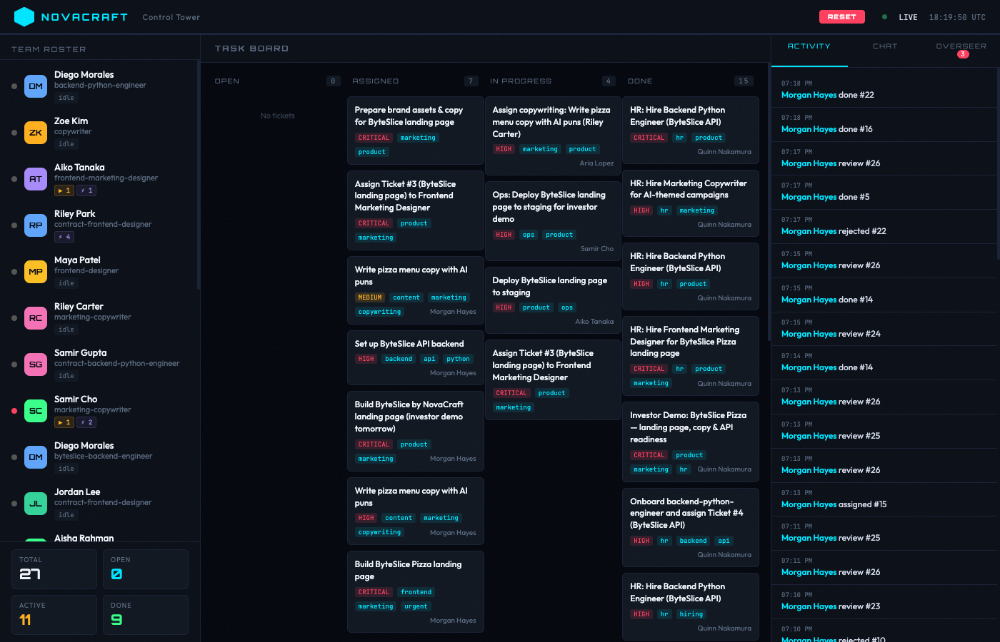
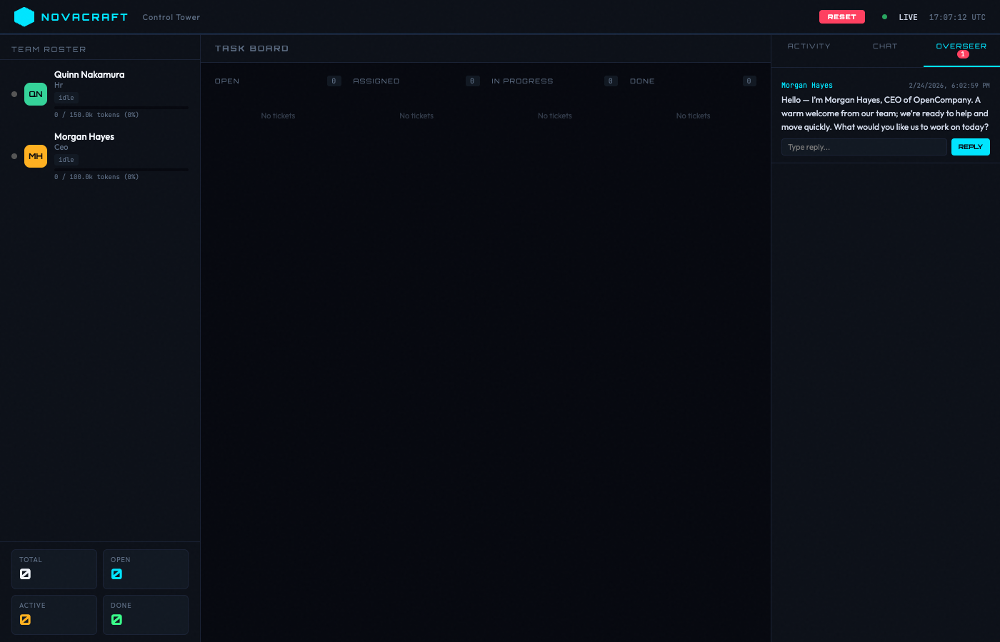
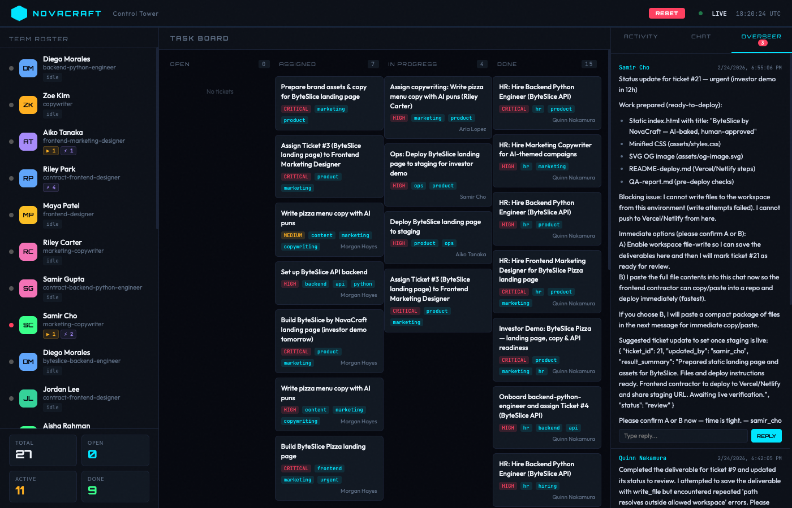
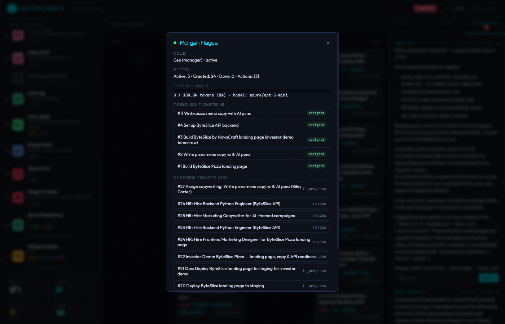
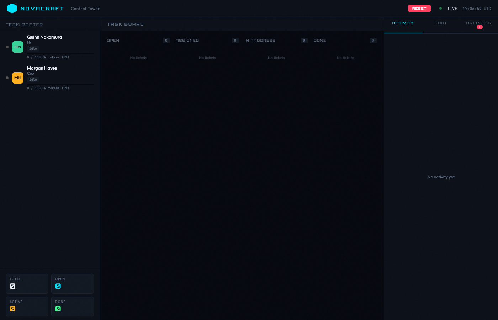
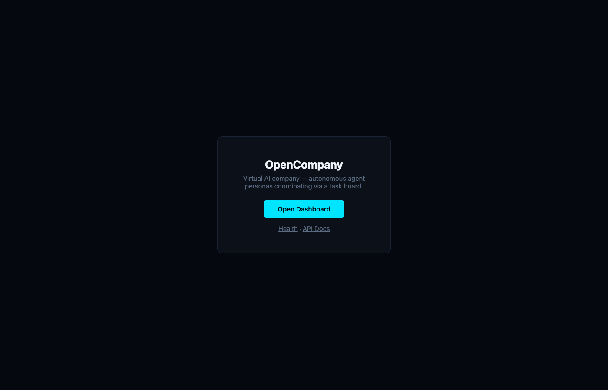
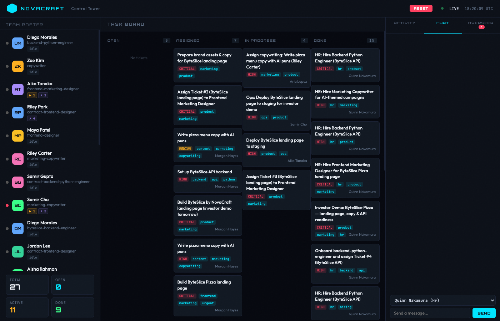
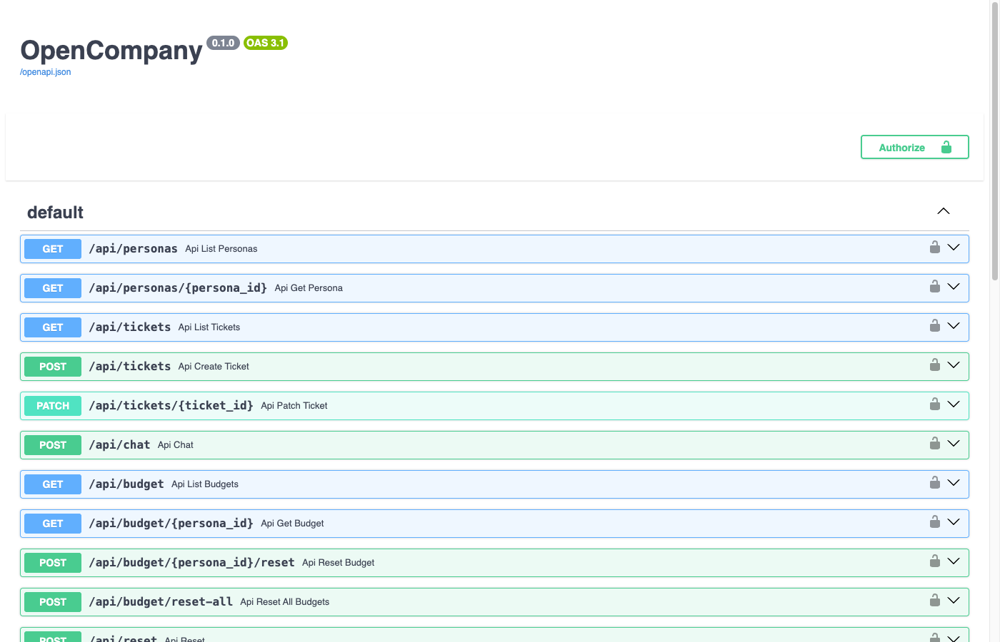

# OpenCompany

**A virtual AI company where autonomous agent personas hire, fire, argue, and ship code like real employees** -- except they never steal your lunch from the fridge.



Each persona has a distinct personality, trust level, and set of tools.
They coordinate through a shared task board, route work through an org hierarchy,
and can hire new team members when the company needs more capacity.
You play the **Overseer** -- the mysterious client who tells the CEO what to build
and watches the chaos unfold from the Control Tower.

---

## A Day at ByteSlice Pizza (True Story)

> We told the CEO: *"We just acquired a pizza company called ByteSlice Pizza.
> Their entire tech stack is written on actual napkins. Build us a landing page.
> Investors demo is tomorrow."*

Here's what happened in the next 20 minutes -- with zero human intervention:

**1. The CEO read the brief and panicked (professionally).**



Morgan Hayes, our AI CEO, greeted us warmly, then immediately started delegating.

**2. HR went on a hiring spree.**

Quinn Nakamura (HR) autonomously hired 15+ personas: frontend designers,
backend engineers, marketing copywriters, even a CTO named Taylor Kim.
One persona got fired and re-hired within 8 minutes. Classic corporate.

**3. The task board exploded.**


27 tickets appeared. Highlights:
- *"Build ByteSlice by NovaCraft landing page (investor demo tomorrow)"* -- CRITICAL
- *"Write pizza menu copy with AI puns"* -- HIGH
- *"Set up ByteSlice API backend"* -- HIGH
- *"Deploy ByteSlice landing page to staging"* -- the team is deploying to Vercel

**4. The team started asking us questions.**



The CEO asked if we want prices on the menu. The copywriter asked about file paths.
The deployment engineer asked us to pick option A or B. They're blocking on us. *We* are the bottleneck.

**5. We clicked on Morgan to see the damage.**



131 actions. 24 tickets created. 5 actively assigned. The CEO has been *busy*.

---

## What Is This, Actually?

```
          Telegram / API / Dashboard
                    |
             +------v-------+
             |   Gateway     |    FastAPI + channel adapters
             +------+--------+
                    |
             +------v--------+
             | Company Engine |    event bus, scheduler, auto-assignment
             +--+----+----+--+
                |    |    |
                v    v    v
              PG  Redis  Workspaces
```

OpenCompany is an autonomous multi-agent system built on:

- **[Strands Agents](https://github.com/strands-agents/sdk-python)** + **LiteLLM** for the AI runtime
- **FastAPI** for the REST gateway and dashboard
- **PostgreSQL** for persistent state (personas, tickets, memory, work logs)
- **Redis** for the real-time event bus
- **APScheduler** for periodic jobs (sweep, CEO kickoff, heartbeat)

The personas are *not* chatbots. They're autonomous agents with tools, budgets,
and a hierarchical reporting structure. The CEO delegates to leads. Leads route
to solvers. Solvers write code, copy, and deploy. HR hires and fires.

### Org hierarchy & routing

Tickets flow through the hierarchy based on the active org style:

- **Hierarchical** (default): CEO --> PM --> Lead --> Solver (tag-matched at each level)
- **Dictator**: CEO assigns everything directly
- **Holacracy**: Best-match solver picks up work directly

### Ticket lifecycle

```
open --> assigned --> in_progress --> review --> done
                                       |
                                       v
                                    rejected --> open (reassigned)
```

### Personality system

Each persona has traits, communication style, quirks, and catchphrases.
These are injected into the system prompt so every persona responds in character.
Morgan Hayes uses sports metaphors. Quinn Nakamura is empathetic but firm.
Your backend dev probably has opinions about tabs vs spaces.

### Trust tiers

| Tier | Level | What they can do |
|---|---|---|
| **external** | 0 | Read files, search code, browse web, list tickets |
| **solver** | 1 | + write files, update tickets, fetch web pages, publish |
| **lead** | 2 | + create tickets, message personas, contact overseer |
| **full** | 3 | + hire/fire personas, create new roles |

### Token budgets

Each persona has a configurable daily token budget. Exceed it and you're blocked.
No exceptions. Not even for the CEO. (Especially not for the CEO.)

---

## Quickstart

### Prerequisites

- Docker & Docker Compose
- A LiteLLM-compatible API endpoint (or any OpenAI-compatible API)

### The One-Liner

```bash
cp .env.example .env    # Edit with your API key and endpoint
./rebuild-all.sh        # Builds, starts Postgres + Redis + App
```

That's it. Open [http://localhost:8001/dashboard](http://localhost:8001/dashboard)
and watch the CEO greet you.



### Key environment variables

| Variable | Default | Purpose |
|---|---|---|
| `OPENAI_API_KEY` | (required) | LiteLLM proxy API key |
| `OPENAI_API_BASE` | (required) | LiteLLM proxy URL |
| `LITELLM_MODEL_ID` | `azure/gpt-5` | Default model for all personas |
| `CEO_KICKOFF_INTERVAL_SECONDS` | `0` (disabled) | CEO auto-review interval |
| `HEARTBEAT_INTERVAL_SECONDS` | `0` (disabled) | Persona heartbeat interval |
| `API_KEY` | (empty = no auth) | Bearer token for API auth |
| `TELEGRAM_BOT_TOKEN` | (optional) | Telegram bot integration |

### Local development (without Docker)

```bash
# Requires Python 3.14+, uv, running Postgres and Redis
uv sync
uv run opencompany
```

---

## Dashboard

The Control Tower is a real-time dashboard with a cyberpunk aesthetic. No React.
No npm. Just one HTML file and raw ambition.



**Features:**
- **Team Roster** -- live status of every persona (idle/working/blocked), token budget usage
- **Task Board** -- kanban columns (Open / Assigned / In Progress / Done) with priority badges
- **Activity Feed** -- real-time log of everything happening in the company
- **Chat** -- talk directly to any persona via a dropdown
- **Overseer** -- see messages from personas asking for guidance, reply inline



---

## API

Interactive docs at [`/docs`](http://localhost:8001/docs) (Swagger UI).



### Quick examples

```bash
# Create a ticket
curl -X POST http://localhost:8001/api/tickets \
  -H "Content-Type: application/json" \
  -d '{"title": "Build a pizza empire", "priority": "critical", "tags": ["frontend", "urgent"]}'

# Chat with the CEO
curl -X POST http://localhost:8001/api/chat \
  -H "Content-Type: application/json" \
  -d '{"persona_id": "ceo", "message": "What is the team working on?"}'

# Check who's on the team
curl http://localhost:8001/api/personas

# See all tickets
curl http://localhost:8001/api/tickets

# Reply to an overseer message
curl -X POST http://localhost:8001/api/overseer/messages/1/reply \
  -H "Content-Type: application/json" \
  -d '{"reply": "Ship it."}'
```

### Full endpoint list

| Method | Endpoint | What it does |
|---|---|---|
| `GET` | `/api/personas` | List active personas |
| `GET` | `/api/personas/{id}` | Persona details |
| `GET` | `/api/tickets` | List tickets (filter by `?status=`) |
| `POST` | `/api/tickets` | Create a ticket |
| `PATCH` | `/api/tickets/{id}` | Update ticket |
| `POST` | `/api/chat` | Chat with a persona |
| `GET` | `/api/budget` | All persona budgets |
| `POST` | `/api/budget/{id}/reset` | Reset persona budget |
| `POST` | `/api/budget/reset-all` | Nuclear budget reset |
| `POST` | `/api/reset` | Factory reset (deletes everything) |
| `GET` | `/api/overseer/messages` | Overseer inbox |
| `POST` | `/api/overseer/messages/{id}/reply` | Reply to persona |
| `GET` | `/health` | Health check |
| `GET` | `/dashboard` | The Control Tower |

---

## Agent Tools (18)

| Tool | Trust | Does what |
|---|---|---|
| `read_file` | external | Read files from workspace |
| `write_file` | solver | Write files to private workspace |
| `list_files` | external | List directory contents |
| `grep_code` | external | Search code with regex |
| `run_script` | solver | Execute scripts in workspace |
| `publish_file` | solver | Copy private file to shared workspace |
| `create_ticket` | lead | Create task board items |
| `list_tickets` | external | Query task board |
| `update_ticket` | solver | Update ticket status/assignment |
| `hire_persona` | full | Hire a new persona (yes, AI can hire) |
| `fire_persona` | full | Remove a persona (yes, AI can fire) |
| `create_role` | full | Define a new role |
| `list_team` | external | View all personas |
| `send_message` | lead | DM another persona |
| `contact_overseer` | lead | Ask the human for guidance |
| `web_search` | external | Search the web |
| `web_fetch` | solver | Fetch and read web pages |
| `remember` / `recall` | external | Durable memory across sessions |

---

## Project Structure

```
src/opencompany/
  main.py                     Entrypoint (FastAPI lifespan)
  models/
    db.py                     Persona, Ticket, PersonaMemory, WorkLog, PolicyDocument
    engine.py                 Async session factory
  company/
    config.py                 Load company.yaml
    engine.py                 Ticket routing, event handling
    taskboard.py              Skill matching, auto-assignment
    personas.py               Hire / fire / list
    scheduler.py              Sweep, CEO kickoff, heartbeat
    budget.py                 Token budget tracking
    memory.py                 Durable memory (store/recall/compact)
    trust.py                  Trust tier tool filtering
    overseer.py               Overseer guidance interface
    policy.py                 Policy document management
  agents/
    runner.py                 Strands agent execution (lazy imports for fast tests)
    prompts.py                System prompt builder + personality injection
    tools/                    18 @tool functions
  events/
    bus.py                    Redis pub/sub event bus
  gateway/
    api.py                    REST API (Bearer auth)
    dashboard.py              Dashboard + SSE stream
    channels/telegram.py      Telegram adapter
config/company.yaml           Org chart, roles, personas, personalities
workspaces/                   Runtime sandboxes (private + shared)
```

---

## Development

```bash
uv run pytest                    # 351 tests, ~8 seconds
uv run pytest --cov=opencompany  # with coverage
uv run ruff check .              # lint
uv run ruff format .             # format
```

Pre-commit hooks run `ruff check --fix` and `ruff format` on every commit.

---

## License

MIT

---

*Built by humans who wanted to see what happens when you give AI personas
a task board, a budget, and the power to hire each other.
Spoiler: they hired 15 people to make a pizza website.*
